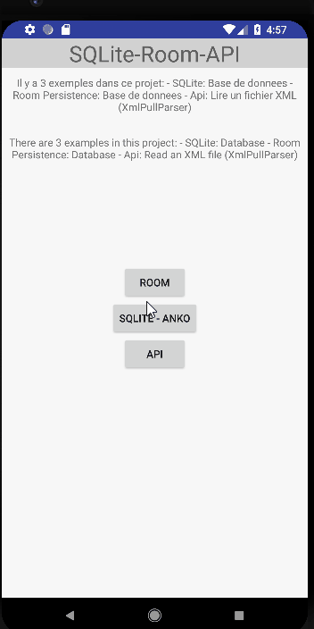

# SQLite-Room-Api

#### Mihaly VARGA
##### LP-DAM

Il y a 3 examples :

### SQLite

SQLite est intégrée dans chaque appareil Android. L'utilisation d'une base de données SQLite sous Android ne nécessite pas de configuration ou d'administration de la base de données.

Vous devez uniquement définir les instructions SQL pour créer et mettre à jour la base de données. Ensuite, celle-ci est gérée automatiquement pour vous, par la plate-forme Android.

L'accès à une base de données SQLite implique l'accès au système de fichiers. Cela peut être lent. Par conséquent, il est recommandé d'effectuer les opérations de base de données de manière asynchrone.

### Room Persistence

Room : exploration de la librairie Android fournissant des outils pour créer, requêter et manipuler plus facilement des bases de données SQLite

Les Architectures Components se divisent en quatre catégories :

LifeCycle : Un set d’APIs permettant de mieux maîtriser les cycles de vie des activités et fragments.

LiveData : Une classe faisant office de wrapper permettant d’observer des changements de données.

ViewModel : Une classe permettant de garder des données ou un état sans qu’elle ne soit impactée par un changement de configuration (rotation de l’écran…)

### Api - communication avec un serveur

Inspiration:

https://www.techotopia.com/index.php/Kotlin_Threads_and_AsyncTasks

https://www.javatpoint.com/kotlin-android-xmlpullparser-tutorial

Le langage de programmation Java fournit plusieurs bibliothèques standards pour le traitement des fichiers XML. Les parseurs XML, SAX et DOM sont également disponibles sur Android.

Android fournit la classe XmlPullParser pour analyser et écrire du XML. Ce parseur n'est pas disponible dans la norme Java, mais il est similaire à Stax. Il est hébergé sur http://www.xmlpull.org/.
